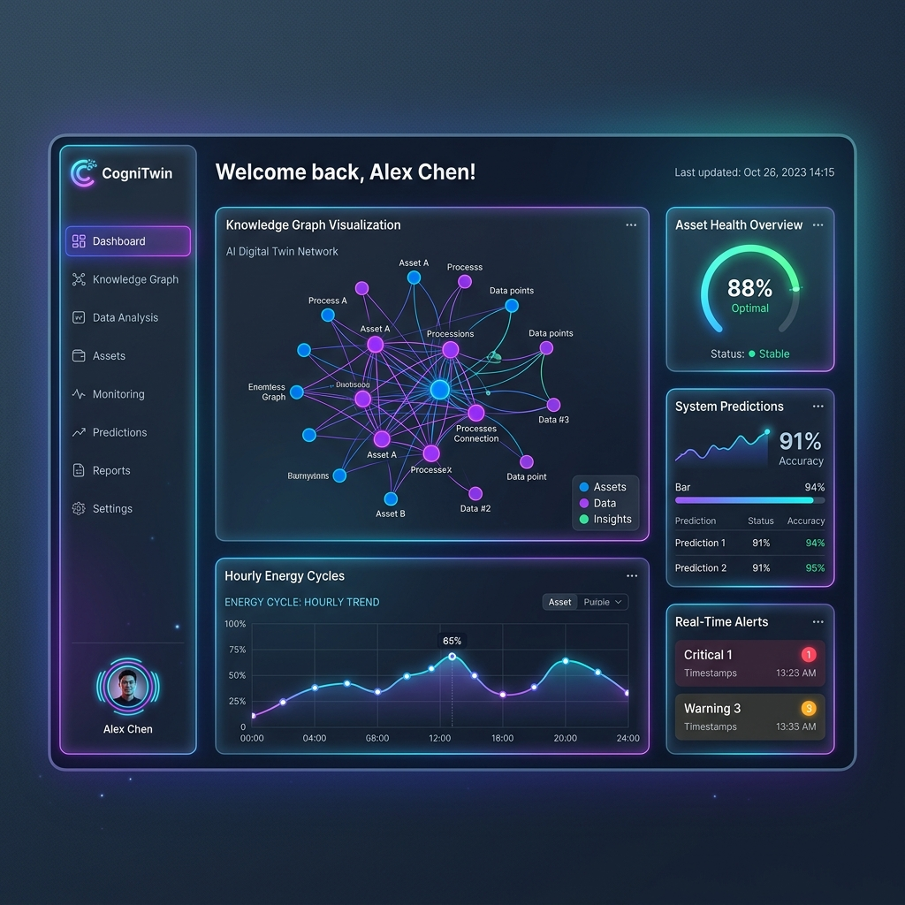
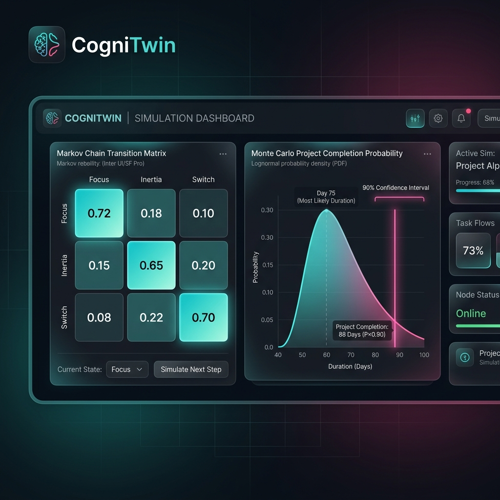
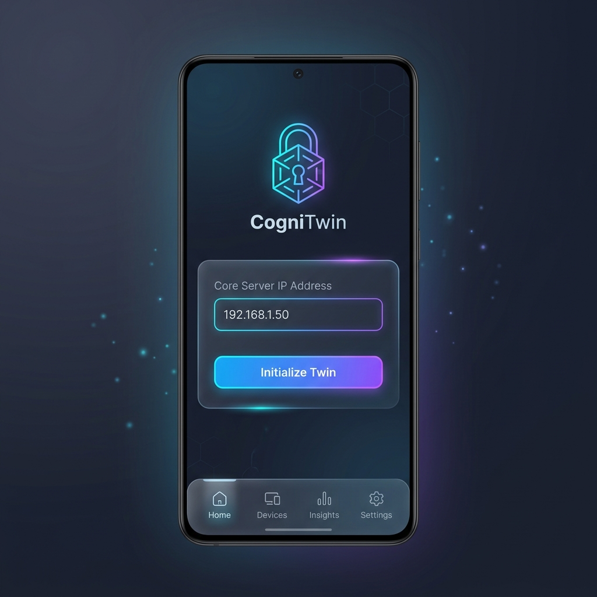

# CogniTwin: The Personal Digital Twin Workbench

CogniTwin is a local-first, highly secure personal digital twin dashboard designed to consolidate your digital self, automate local tasks, and mathematically model your workflow capacity. 

Built using **Electron, React, TypeScript, and SQLite**, CogniTwin processes all your data locally, ensuring absolute privacy.

### 🖼️ Interfaces Preview

#### 🖥️ Main Dashboard (Desktop/Web)


#### 📊 Twin Capacity Simulation Engine


#### 📱 Mobile Client (Android Server IP Binding)


---

## 🚀 Key Features

### 1. 🧠 Core Intelligence & Knowledge Graph
* **Semantic Vector Search**: Automatically parses and indexes ingested documents, notes, and emails offline using local embeddings.
* **Interactive Knowledge Graph**: Interactive force-directed network graph visualizing connections between different entities (notes, files, tasks).
* **Concept Clustering**: Automatically identifies themes and clusters related knowledge concepts.
* **Spaced Repetition & Study**: Local flashcards system with built-in spaced repetition study schedules.

### 2. ⚡ Local Ingestions & Automations
* **Universal File Watchers**: Monitors directory folders for automatic file ingestion and indexing.
* **Triage Sync**: Integrates calendar feeds (CalDAV), email triages (IMAP), and local browser history files.
* **Trigger-Action Rule Engine**: Create customizable rules (e.g., *When note is added containing keyword X, tag it under project Y*).
* **Macro Actions**: Record and replay input sequences.

### 3. 📊 Mathematical Digital Twin Simulations
* **Markov State Transition**: Forecasts a 24-hour state timeline predicting your focus, rest, and meeting state cycles based on your log history.
* **Monte Carlo Timeline Forecaster**: Simulates 1,000 project completion pathways using random focus capacity variables and lognormal noise.
* **Bayesian Expected Utility Optimizer**: Multi-criteria utility ranking matrices to assist in rational decision making.

### 4. 🔐 Security & Privacy
* **Military-Grade Local Encryption**: Encrypts sensitive fields at rest using PBKDF2 key derivation and AES-256-GCM.
* **Privacy Mode**: Instant dynamic CSS blurs on sensitive areas and regex content redactions.
* **DoD 5220.22-M Sector Shredder**: Overwrites deleted files with a 3-pass cryptographic wipe.

### 5. 🔌 Scripting & Extensibility
* **Scripting Console**: Local JavaScript (with dbQuery helpers) and Python runtime executor.
* **Dynamic Plugin Loader**: Safely evaluates and loads third-party plugins in sandboxed environments.

---

## 🛠️ Technical Stack
* **Desktop Shell**: Electron (Main/Preload process)
* **Mobile Shell**: CapacitorJS (Android native Gradle container)
* **API Server**: Express (Port `3000`), CORS, Server-Sent Events (SSE)
* **Frontend**: React, TypeScript, Vanilla CSS, Recharts
* **Database**: SQLite (`better-sqlite3`), `sqlite-vec` (vector database extensions)
* **Local ML**: `node-llama-cpp` (ESM dynamic load) for offline GGUF LLMs

---

## 📱 Cross-Platform Architecture (Web & Mobile)
CogniTwin is designed to run in two modes:
1. **Desktop Native (Electron)**: The application boots as a single process running a native desktop window.
2. **Client-Server (Web & Mobile)**: The backend runs as a headless server (Port `3000`), and clients connect via standard web browsers or the native Android app.

---

## 💻 Installation & Setup

### 1. Clone the repository
```bash
git clone https://github.com/ik123a/CogniTwin.git
cd CogniTwin
```

### 2. Install Dependencies
```bash
npm install
```

### 3. Rebuild Native Modules (Required for SQLite)
To ensure the native C++ bindings for SQLite match your local Node/Electron runtimes, execute:
```bash
npm run postinstall
```

### 4. Setup Local LLM Model
Ensure you have the GGUF model downloaded to `resources/models/qwen2.5-1.5b-instruct-q4_k_m.gguf` or update the model path in the LLM service configuration.

---

## 🏃 Running the Application

### 🖥️ Running as a Desktop Client
```bash
# Start Electron dev server (runs core backend server alongside window UI)
npm run dev
```

### 🌐 Running as a Local Web App
1. Run `npm run dev` to start the backend Express server on Port `3000`.
2. Open your web browser and navigate to: `http://localhost:5173/`
3. Click **Configure Server IP** on the login page and enter your PC's IP address (default: `localhost`).

### 📱 Running as a Native Android App
1. Build the production web bundle and sync assets to Capacitor:
   ```bash
   npm run build
   npx cap copy android
   ```
2. Open the `android/` workspace folder in **Android Studio**.
3. Plug in your Android phone (with USB Debugging active) or select an emulator.
4. Click **Run/Play** in Android Studio to build the native APK and install it.
5. On the startup page, click **Configure Server IP**, enter your PC's local network IP address (e.g. `192.168.1.50`), and tap **Initialize Twin**!

---

## ⚙️ Building Production Installers
```bash
# Package the desktop application for your host OS installer
npm run build
```
